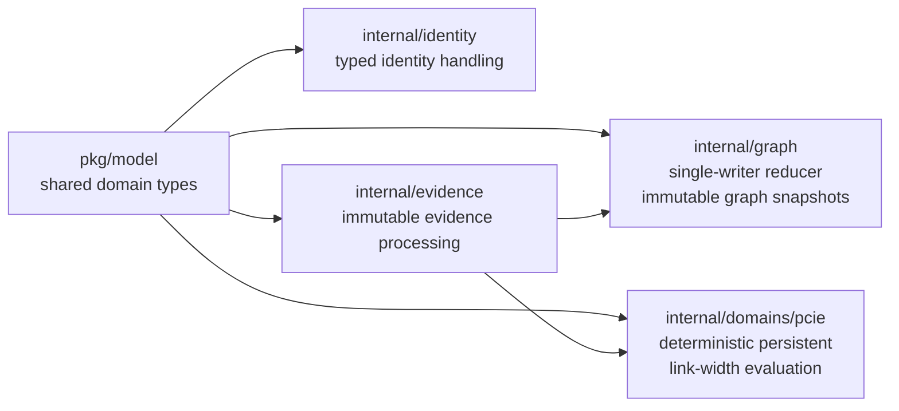
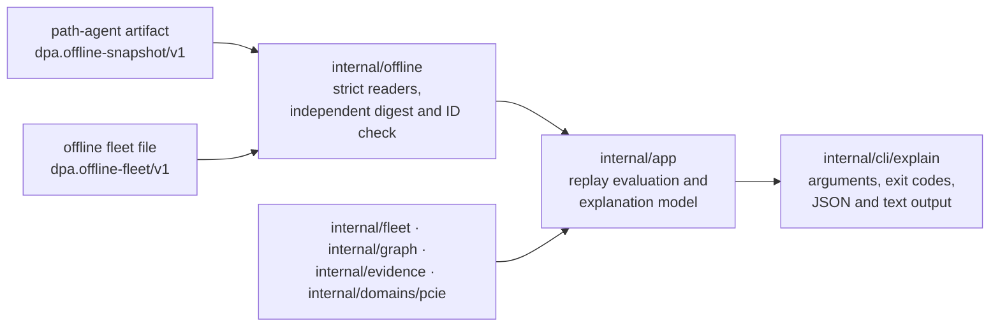
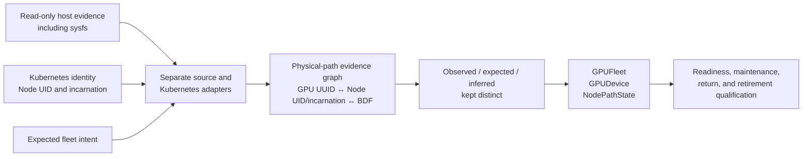

# Architecture

data-path-assurance is organized as a modular Go monolith. Domain packages stay
independent of Kubernetes and other infrastructure clients; adapters belong at
the edge of the application.

## Implemented core

The current code is a library-level domain core plus two offline tools.
`internal/agent`, run by `path-agent --fixture-root`, turns a fixture sysfs tree
and canned NVIDIA inventory into a JSON snapshot artifact. `pathctl explain`
evaluates that artifact offline (see [Offline explain](#offline-explain)). There
is no live agent, controller, Kubernetes adapter, or custom resources.

Arrows point from a shared building block to the package that consumes it.

The graph reducer serializes state changes through one writer and exposes
immutable state. Evidence is also treated as immutable. These constraints make
repeated processing easier to reason about and keep PCIe evaluation
deterministic for the same supplied inputs.

The PCIe domain evaluates persistent negotiated-width degradation against an
expected width. It is passive and does not reset devices, change drivers, or
alter host state.

`internal/fleet` adds pure GPU and node evaluation to this core. Its public
functions are `NewPolicy`, `AdmitSnapshot`, `EvaluateDevice`, `AggregateNode`,
and `EvaluateGate`. They consume explicitly supplied policy, evidence, and time
and return domain values or actions. A scheduling-gate action is a
decision value; the package does not mutate Kubernetes.

Snapshot admission distinguishes accepted, duplicate, older or out-of-order,
gap, wrong-session, and conflicting input. A duplicate preserves the admitted
original. Fresh evidence and distinct accepted normal points drive readiness,
and identity, request, or policy changes reset that progress. Unknown is not
success evidence.

GPU identity is bound to node UID, boot identity, and PCI BDF through trusted
observed evidence. Maintenance or retirement completion requires a trusted
fence matching the current intent and a complete, fresh allocation-empty
assessment. These are evaluations of supplied inputs, not host collection or
cluster operations.

Current qualification coverage is limited to the GPU PCIe parent path, root
path, and link-width evidence. GPU/NIC shared-ancestor proof is not implemented
and remains Unknown; live LLDP coverage also remains Unknown until collection
is added.

The domain packages, including `internal/fleet`, are protected from direct and
transitive imports of external adapters.

### Native PCIe observer adapter

`internal/nativepcie` is an adapter, not part of the domain core. It bridges
through cgo to `libdpa_pcie` (`internal/nativepcie/csrc`), a bounded C11 library
that only parses caller-supplied sysfs text and reads caller-opened
descriptors from offset zero. The C code never opens a path, reads the
environment, allocates, spawns threads, handles signals, or logs, and it keeps
no state between calls. `ReadDevice` resolves every device path through a
caller-injected `*os.Root` (invariant 7: no `/sys` constant) and returns raw
per-field facts with independent statuses. It performs no discovery, identity
resolution, topology inference, or readiness/health evaluation; feeding its
observations into evidence remains future host-adapter work. `make arch-check`
rejects any domain-core dependency on `internal/nativepcie` or on cgo. On
unsupported targets or with `CGO_ENABLED=0` the package is an unavailable
stub.

### Offline explain

`pathctl explain` is wired in `cmd/pathctl` from three packages. Each arrow
points from a package to the package it hands values to.

`internal/offline` is a driven adapter. It reads the two files, recomputes the
artifact digests and IDs independently of the collector, and converts the
frames into domain values. `internal/app` belongs to the domain core checked by
`make arch-check`: it runs the frame admission chain, evaluates each frame at
its own observed time, and assembles the explanation without depending on file
formats or I/O, so the future controller explain API can reuse it.
`internal/cli/explain` is the driving adapter that parses arguments and formats
the explanation. The command depends on neither `internal/agent` nor the native
PCIe observer and builds with `CGO_ENABLED=0`.

## Target executable integration

The following flow describes the intended integration around the implemented
domain libraries. Its adapters, control plane, and Kubernetes resources are not
implemented yet.

The target keeps infrastructure integration outside the domain core. Host
collection is read-only, and the project does not introduce a custom time
series database. Evidence needed for a decision belongs in the lifecycle data
model, while active operations remain with the systems that already own them.

## Boundaries

data-path-assurance is intended to qualify and explain physical-path state. It
does not own active GPU workloads, device reset, node drain, or driver
management. A GPU operator or another cluster operator continues to perform
those actions.

The fleet library evaluates supplied identity, evidence, lifecycle intent, and
allocation state. It does not collect those inputs from a real host or cluster;
the offline explain path evaluates recorded fixture snapshots only.
Collectors, transport, Kubernetes APIs, and deployment remain future work, and
the system has not been validated on real GPUs or made available for
installation.
